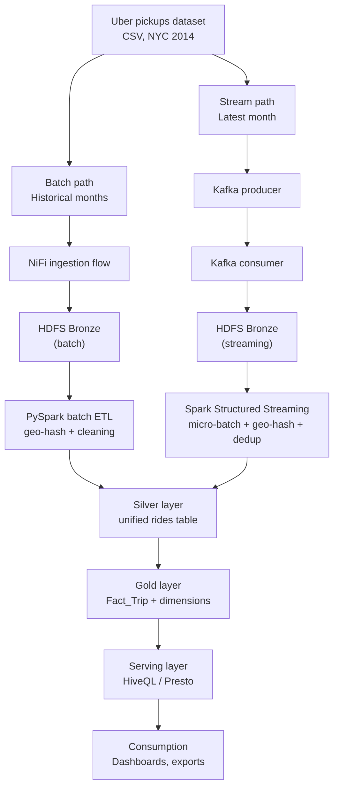

<div align="center">

# Uber NYC Rides Pipeline

**An end-to-end medallion-architecture (Bronze → Silver → Gold) data pipeline on the Uber NYC 2014 pickups dataset**, unifying a batch ingestion path and a simulated real-time streaming path into a single dimensional data warehouse.


</div>

---

## Table of Contents

- [Overview](#overview)
- [Architecture](#architecture)
- [Tech Stack](#tech-stack)
- [Repository Structure](#repository-structure)
- [Data Source](#data-source)
- [Pipeline Components](#pipeline-components)
  - [Streaming Path](#streaming-path)
  - [Batch Ingestion (NiFi)](#batch-ingestion-nifi)
  - [Batch Processing](#batch-processing)
  - [Gold Layer / Data Warehouse](#gold-layer--data-warehouse)
  - [Serving Layer](#serving-layer)
- [Getting Started](#getting-started)
- [Pipeline Control Panel](#pipeline-control-panel)
- [Dashboards](#dashboards)
- [Project Status](#project-status)
- [Key Design Decisions](#key-design-decisions)

---

## Overview

This project ingests the **Uber NYC 2014 pickups dataset** through two parallel paths — a historical **batch path** and a simulated **real-time streaming path** — and merges them into a unified Silver layer. From there, a dimensional **Gold layer** (star schema) is built and exposed through a **Serving layer** queryable with HiveQL and Presto, feeding analytical dashboards.

The pipeline is fully orchestrated: every stage (streaming, batch, Silver union, Gold ETL, export) can be triggered independently or run end-to-end through a single control panel.

## Architecture



- **Batch path** — historical monthly CSVs are ingested via an Apache NiFi flow into HDFS Bronze, then cleaned and geo-hashed with PySpark.
- **Stream path** — the final month of data is replayed through a Kafka producer, consumed, and processed with Spark Structured Streaming.
- Both paths are deduplicated and normalized to the same schema before being unioned into Silver.
- **All layers — Bronze, Silver, Gold, and checkpoints — live on HDFS.** Local disk is used only for code, configuration, and orchestration scripts.

## Tech Stack

| Layer | Technology |
|---|---|
| Ingestion (batch) | Apache NiFi, HDFS |
| Ingestion (stream) | Apache Kafka |
| Processing | Apache Spark (Structured Streaming + batch), PySpark |
| Storage | HDFS |
| Warehouse | Hive external tables (star schema) |
| Query engine | HiveQL, Presto |
| Orchestration | Shell scripts + Python control panel (`app.py`) |

## Repository Structure

```
Uber_End_to_End_Data_Pipeline/
├── kafka/                          # Kafka producer & consumer
├── spark/                          # Structured Streaming + batch ETL + Gold ETL jobs
├── app.py                          # Pipeline control panel
├── export_final.py                 # Exports final Gold tables to coalesced CSVs
├── hive_ddl.sql                    # Hive external table DDL over Silver/Gold
├── start_streaming.sh              # Start the streaming path
├── stop_streaming.sh               # Stop the streaming path
├── start_batch.sh                  # Start the batch path
├── stop_batch.sh                   # Stop the batch path
├── run_pipeline_background.sh      # Run the full pipeline end-to-end, in the background
├── stop_pipeline_background.sh     # Stop a backgrounded full pipeline run
├── .gitignore
└── README.md
```

## Data Source

The **Uber NYC pickups dataset** — 11 monthly raw CSV files (`uber_raw_data_02_14.csv` … `uber_raw_data_12_14.csv`) plus a `manifest.csv`.

Each record contains: `trip_id`, `start_lat`, `start_lon`, `end_lat`, `end_lon`, `start_time`, `end_time`, `distance`.

The final month, `uber_raw_data_12_14.csv`, is used as the source for the simulated Kafka stream; the remaining months feed the batch path.

## Pipeline Components

### Streaming Path

- **Producer** — reads the source file unmodified and publishes it to Kafka, pacing message delivery itself rather than following the original trip timestamps. Loops the file indefinitely until stopped.
- **Consumer** — lands streamed records as files in the HDFS Bronze streaming folder, so Spark can pick them up as soon as a new file appears.
- **Spark Structured Streaming** — watches the Bronze streaming folder and processes new files into Silver.
- **Deduplication** — since the producer loops indefinitely (~8 hours per cycle), a time-bounded watermark isn't sufficient. Instead, a persistent *seen-trip-ids* file on HDFS is checked and updated per micro-batch via `foreachBatch`, guaranteeing zero duplicates in Silver regardless of elapsed time.

### Batch Ingestion (NiFi)

Historical files are ingested into HDFS Bronze through an Apache NiFi flow:

| Processor | Role |
|---|---|
| `ListFile` | Detects source files to ingest |
| `DetectDuplicate` | Skips files already ingested |
| `FetchFile` | Retrieves file content |
| `PutHDFS` | Writes content to HDFS |
| `RetryFlowFile` | Retries failed attempts |
| `PutFile_DLQ` | Routes repeated failures to a dead-letter queue |

### Batch Processing

A PySpark batch ETL job processes Bronze batch data into an output shape matching the stream path's output, so the two can later be unioned into a single Silver layer (batch-origin and stream-origin records kept as separate files within Silver).

### Gold Layer / Data Warehouse

The Gold layer is a star schema, built incrementally via a Gold ETL job using the same seen-id tracking pattern as the streaming job — one tracking file per dimension, guaranteeing idempotent, duplicate-free incremental builds.

**`FACT_TRIP`**
`trip_id (PK)` · `date_key (FK)` · `time_key (FK)` · `start_geo_key (FK)` · `end_geo_key (FK)` · `duration_bucket_key (FK)` · `start_time` · `trip_duration_sec` · `trip_count` · `is_same_cell`

**Dimensions**

| Table | Key fields |
|---|---|
| `DIM_DATE` | date_key (PK), full_date, day, day_name, day_of_week, is_weekend, week_of_year, month, month_name, quarter, year |
| `DIM_TIME` | time_key (PK), hour, minute, period, is_rush_hour |
| `DIM_GEOGRAPHY` | geo_hash (PK), lat, lon, parent_geo_res6, parent_geo_res5 |
| `DIM_DURATION_BUCKET` | duration_bucket_key (PK), bucket_label, min_seconds, max_seconds |

The geography dimension uses a hierarchical geo-hash, with `parent_geo_res6`/`parent_geo_res5` as coarser resolution levels above the base `geo_hash`.

### Serving Layer

`hive_ddl.sql` defines Hive external tables over the Silver and Gold layers, queried via **HiveQL** and **Presto**. `export_final.py` coalesces the final Gold tables into single CSV files for downstream dashboard building.

## Getting Started

> Requires a working Hadoop/HDFS, Kafka, and Spark environment (the pipeline was built and run on a CentOS VM).

```bash
# Start the streaming path (Kafka producer + consumer + Spark Structured Streaming)
./start_streaming.sh

# Start the batch path (NiFi ingestion + PySpark batch ETL)
./start_batch.sh

# ...or run everything end-to-end in the background
./run_pipeline_background.sh

# Stop individual paths
./stop_streaming.sh
./stop_batch.sh

# Stop a backgrounded full-pipeline run
./stop_pipeline_background.sh

# Export final Gold tables to local CSV
python export_final.py
```

Hive external tables are created from `hive_ddl.sql`:

```bash
hive -f hive_ddl.sql
```

## Pipeline Control Panel

`app.py` exposes every pipeline stage as an individually triggerable action, plus a single **Run Full Pipeline** action that runs batch and streaming together, then Silver Union → Gold ETL → Export in order, stopping immediately on the first failure. It also includes a Hive query box supporting multiple `;`-separated statements.

## Dashboards

The Gold layer feeds a three-page analytical dashboard:

1. **Overview** — total trips, average duration, trips by day/month, weekday vs. weekend split, trips by hour
2. **Time & Geography** — geographic trip distribution, top start/end regions, route breakdown, rush-hour split
3. **Duration Analysis** — trip distribution and average duration by duration bucket

## Project Status

- ✅ Streaming path (Kafka → Spark Structured Streaming → Silver) — complete, including deduplication
- ✅ Batch data uploaded to Bronze on HDFS
- 🔄 Batch ETL (aligning output shape with the stream path) — in progress
- ⏳ Silver union, Gold layer, and export — pending batch completion

## Key Design Decisions

- **Why not a watermark for deduplication?** The producer's loop cycle (~8 hours) outlasts any practical watermark window, so a persistent seen-id file on HDFS is used instead — durable across the entire run, not just a time window.
- **Why keep everything on HDFS?** Keeps the pipeline consistent with the original architecture (Bronze on HDFS) and keeps local disk limited to code, configuration, and orchestration scripts.
- **Why match batch output to stream output?** So the two independently-built paths can be unioned into Silver without a reconciliation step.

---

<div align="center">
<sub>Built as part of a data engineering training program.</sub>
</div>
